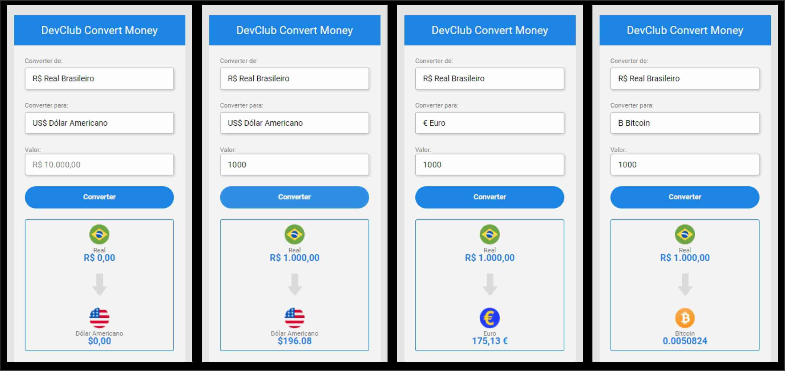

<h2>🚀 Nome do Projeto:</h2>

<h3>Conversor de Moedas - DevClub.</h3>

<h2>📝 Descrição do Projeto:</h2>

<h3>Conversor de Moedas feito utilizando as linguagens HTML, CSS e JavaScript.</h3>
<h3>A conversão pode ser feita de Real Brasileiro para Dólar Americano, Euro ou Bitcoins.</h3>
<h3>O projeto consume uma API do AwesomeAPI, que atualiza os valores a cada 30 segundos.</h3>

 

<h2>🖥️ Linguagens Utilizadas:</h2>

 
 
 

<h2>🧰 Ajustes e melhorias:</h2>

<h4>O projeto foi finalizado. As próximas atualizações serão voltadas para as seguintes tarefas:</h4>

- [x] Criação do HTML.
- [x] Criação do CSS.
- [x] Criação do Javascript.
- [ ] Atualização da Interface.

 

<h2>💻 Pré-requisitos:</h2>

<h4>O projeto está disponível no GitHub-Pages, pode ser utilizado por qualquer pessoa com um dispositivo com acesso a Internet pelo link abaixo.</h4>

<a>https://olivercaputo.github.io/conversor-de-moedas-devclub/</a>

<h4>Para ter acesso a todo o projeto, basta ter um computador ligado à Internet e uma conta no GitHub para visualizar.</h4>

 

<h2>🤝 Colaboradores</h2>

<h4>Agradeço às seguintes pessoas que contribuíram para este projeto:</h4>

<table>
  <tr>
    <td align="center">
      <a href="https://github.com/olivercaputo">
         
        
          <b>Oliver Caputo</b>
        
      </a>
    </td>
    <td align="center">
      <a href="https://www.github.com/rodolfomori" target="_blank">
         
        
          <b>Rodolfo Mori</b>
        
      </a>
    </td>
        <td align="center">
      <a href="https://www.github.com/iuricode" target="blank">
         
        
          <b>Iuri Silva</b>
        
      </a>
    </td>
  </tr>
</table>
